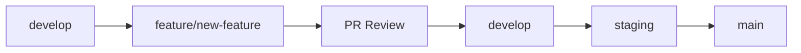
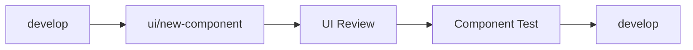
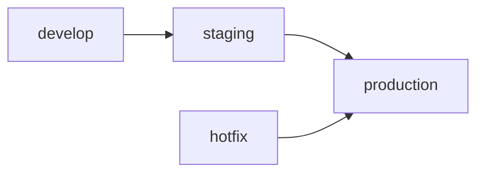

# Recapio Development Strategy

## Version Control Structure

### Environment Branches
- `main` (v4.x.x) - Production environment
- `staging` (v4.x.x-rc) - Pre-production testing
- `develop` (v4.x.x-dev) - Development environment
- `training` (v4.x.x-train) - AI model training environment

### Feature Management
- Feature branches: `feature/[JIRA-ID]-feature-name`
- UI branches: `ui/[JIRA-ID]-component-name`
- Fixes: `fix/[JIRA-ID]-bug-description`
- Hotfixes: `hotfix/[JIRA-ID]-critical-fix`

### Version Numbering Strategy (v4.x.x)
1. Major Version (4.x.x):
   - Breaking changes
   - Major UI overhauls
   - Architecture changes

2. Minor Version (4.1.x):
   - New features
   - Non-breaking enhancements
   - Minor UI updates

3. Patch Version (4.1.1):
   - Bug fixes
   - Security patches
   - Performance improvements

### Environment-Specific Versioning
- Production: v4.1.0
- Staging: v4.1.0-rc.1
- Development: v4.1.0-dev.5
- Training: v4.1.0-train.3

### Version Display System
1. Development Environment:
   - Version chip in bottom-right corner
   - Shows current version and environment
   - Clickable for detailed information
   - Layout type indicator

2. Version Information:
   - Base version (4.x.x)
   - Environment suffix (-dev, -rc, -train)
   - Build number (non-production)
   - Build time
   - Dependencies
   - System information

3. Version Validation:
   - Enforces 4.x.x format
   - Validates on startup
   - Graceful fallback to 4.1.0
   - Console warnings for invalid versions

## Backup and Recovery Strategy

### Git-Based Backup
1. Protected Branches:
   - `main` (requires 2 approvals)
   - `staging` (requires 1 approval)
   - `develop` (requires review)
   - `ui/*` (requires UI team approval)

2. Feature Preservation:
   - Feature branches preserved for 30 days
   - Release tags never deleted
   - Major version branches archived

3. Recovery Points:
   - Release tags (v4.1.0)
   - Environment states (v4.1.0-prod-backup)
   - Feature completion (v4.1.0-feature-complete)

### UI Protection
1. UI Version Control:
   - Separate UI component library tags
   - Component snapshot system
   - Style versioning

2. UI Recovery:
   - Component-level rollback
   - Style system restoration
   - Layout version control

## Development Workflow

### 1. Feature Development


### 2. UI Development


### 3. Release Process
1. Create release branch: `release/v4.1.0`
2. Deploy to staging
3. Testing and QA
4. Create release candidate: `v4.1.0-rc.1`
5. Final testing
6. Merge to main: `v4.1.0`

### 4. Hotfix Process
1. Branch from main: `hotfix/critical-fix`
2. Fix and test
3. Merge to:
   - main (with tag)
   - develop
   - staging

## Feature Management

### Feature Flags
- Development flags
- A/B testing flags
- Environment-specific flags

### Feature Documentation
- Feature specification
- Technical documentation
- UI/UX documentation
- Test cases

## Quality Control

### Code Review Requirements
1. Feature Review:
   - Code quality
   - Test coverage
   - Documentation
   - Performance impact

2. UI Review:
   - Component design
   - Accessibility
   - Responsive design
   - Performance metrics

### Testing Requirements
1. Unit Tests:
   - Business logic
   - UI components
   - API integration

2. Integration Tests:
   - Feature workflows
   - Cross-component interaction
   - API contracts

3. UI Tests:
   - Visual regression
   - Responsive design
   - Cross-browser compatibility

## Deployment Strategy

### Environment Pipeline


### Deployment Verification
1. Automated checks:
   - Build verification
   - Test suite
   - Security scan
   - Performance metrics

2. Manual verification:
   - UI/UX review
   - Feature validation
   - Integration testing

## Recovery Procedures

### 1. Feature Rollback
```bash
git checkout main
git revert [feature-merge-commit]
git push origin main
```

### 2. UI Restoration
```bash
git checkout [ui-version-tag]
git cherry-pick [ui-commits]
git push origin develop
```

### 3. Version Rollback
```bash
git checkout v4.0.9
git checkout -b hotfix/rollback-4.1.0
git push origin hotfix/rollback-4.1.0
``` 