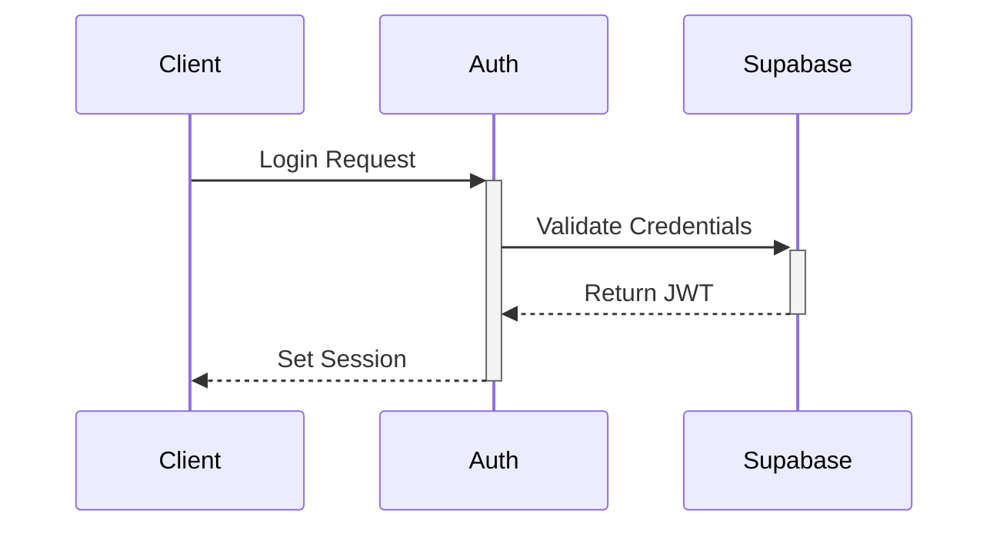

# Technical Architecture Overview

## System Architecture

### High-Level Overview
```
┌─────────────────┐     ┌─────────────────┐     ┌─────────────────┐
│   Next.js App   │────▶│  Supabase API   │────▶│   PostgreSQL    │
└─────────────────┘     └─────────────────┘     └─────────────────┘
         │                       │                        │
         ▼                       ▼                        ▼
┌─────────────────┐     ┌─────────────────┐     ┌─────────────────┐
│    OpenAI API   │     │  Storage (S3)   │     │   Auth System   │
└─────────────────┘     └─────────────────┘     └─────────────────┘
```

## Core Technologies

### Frontend
- Next.js 14.1.0
- React 18
- Material-UI (MUI)
- TailwindCSS
- Redux Toolkit

### Backend
- Supabase
- PostgreSQL
- Node.js

### External Services
- OpenAI API
- Google Cloud Speech-to-Text
- AWS S3 (via Supabase Storage)

## Application Structure

### Directory Layout
```
├── app/                    # Next.js 14 app directory
│   ├── (auth)/            # Authentication routes
│   ├── (marketing)/       # Marketing pages
│   ├── admin/             # Admin dashboard
│   └── api/               # API routes
├── components/            # React components
│   ├── common/           # Shared components
│   ├── forms/            # Form components
│   └── layouts/          # Layout components
├── lib/                   # Utility libraries
│   ├── supabase/         # Supabase client
│   ├── openai/           # OpenAI integration
│   └── hooks/            # Custom React hooks
├── public/               # Static assets
└── types/                # TypeScript definitions
```

## Key Components

### Authentication System
- Supabase Auth
- JWT tokens
- Role-based access control
- Social authentication providers

### Database Schema
- Users and profiles
- Transcripts and processing
- Settings and preferences
- Audit logs and analytics

### API Layer
- RESTful endpoints
- Real-time subscriptions
- Rate limiting
- Error handling

## State Management

### Redux Store Structure
```typescript
interface RootState {
  auth: {
    user: User | null;
    loading: boolean;
    error: string | null;
  };
  transcripts: {
    items: Transcript[];
    currentTranscript: Transcript | null;
    status: 'idle' | 'loading' | 'succeeded' | 'failed';
  };
  settings: {
    theme: 'light' | 'dark';
    language: string;
    notifications: boolean;
  };
}
```

### Context Providers
```typescript
<Providers>
  <AuthProvider>
    <ThemeProvider>
      <SettingsProvider>
        <App />
      </SettingsProvider>
    </ThemeProvider>
  </AuthProvider>
</Providers>
```

## Data Flow

### Request Lifecycle
1. Client action triggers request
2. Redux/Context updates loading state
3. API call made to Next.js route
4. Server processes request
5. Database query/update
6. Response returned to client
7. State updated with result

### Real-time Updates
1. Client subscribes to channel
2. Database change occurs
3. Supabase emits event
4. Client receives update
5. State automatically updated

## Security Architecture

### Authentication Flow


### Authorization
- Row Level Security (RLS)
- Role-based permissions
- API route protection
- Token validation

## Performance Optimization

### Frontend
- Server-side rendering
- Static page generation
- Image optimization
- Code splitting

### Backend
- Query optimization
- Caching strategy
- Connection pooling
- Rate limiting

## Error Handling

### Client-side
```typescript
try {
  await api.request();
} catch (error) {
  if (error instanceof ApiError) {
    handleApiError(error);
  } else {
    handleGenericError(error);
  }
}
```

### Server-side
```typescript
export async function handler(req, res) {
  try {
    // Process request
  } catch (error) {
    logger.error(error);
    res.status(500).json({
      error: 'Internal Server Error',
      requestId: generateRequestId()
    });
  }
}
```

## Monitoring and Logging

### Metrics Collection
- Page load times
- API response times
- Error rates
- User engagement

### Logging Strategy
- Error tracking
- User actions
- Performance metrics
- Security events

## Development Workflow

### Code Organization
- Feature-based structure
- Shared utilities
- Type definitions
- Test coverage

### Build Process
1. Lint and type check
2. Run tests
3. Build application
4. Generate static assets
5. Deploy to environment

## Future Considerations

### Scalability
- Horizontal scaling
- Load balancing
- Database sharding
- Caching layers

### Planned Features
- Enhanced AI processing
- Advanced analytics
- Mobile applications
- API marketplace

## Contributing

When modifying architecture:
1. Update documentation
2. Review security implications
3. Consider performance impact
4. Maintain backwards compatibility 